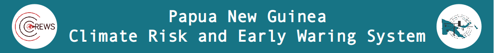

# November 2023 Drought Update
*`Issued: 14/11/2023`*

## Key Messages
Most provinces have experienced well above-average rainfall in recent months, providing relief to drought conditions. Hela on drought watch with servere vulnerability levels. El Niño and positive IOD is underway. While there is still potential that the combined _drying effects_ of El Niño and positive IOD are in play, their effects are not physically visible at this time.
## Drought Early Warning Status (DEWS)
>Derived from observed 3-month rainfall and vegetation health, along with 3-month forecasted rainfall.

![dews map][dews]

- Drought conditions persist for Hela at 3-month timescales. 
- All most all provinces have received well above average rainfall in recent months easing drought conditions at 3-month timescales.
- At the 12-month rainfall timescale, deficiencies linger for Bougainville and some areas in the Highlands and Momase provinces. Long term deficiencies will have different impacts to short term rainfall deficiencies. Low groundwater, brackish wells and reduced streamflow may be some impacts observed at this timescale.

### 3-month time scale provincial summary
((A province's overall status is given by its majority status on the map and is presented in this [summary table](http://access-s.clide.cloud/files/project/PNG_crews/SEMDP-products/monthly/DEWS/drought.status.formatted.gsmap_own.terciles.3m.html)
)
<code style="color : yellow">Drought Watch</code>| <code style="color : orange">Drought Alert</code> | <code style="color : red">Drought Critical</code>
--- | --- | ---
`Below average rainfall or Stressed vegetation or Dry forecast` | `(Below average rainfall or Stressed vegetation) and Dry forecast` | `Below average rainfall and Stressed vegetation and Dry forecast`
Hela | (no province) | (no province)

### 3-month DEWS inputs
3-month Observed Rainfall | 3-month Observed Vegetation Health | 3-month Forecast Rainfall
--- | --- | ---
![standardized rainfall index for 3 months][spi3] | ![vegetation health index for 3 months][vhi3] | ![chance of below, near or above normal rainfall][rfc3]

[dews]: products/November_DEWS.png
[spi3]: products/spi3.png
[vhi3]: products/vhi3.png
[rfc3]: products/rfc3.png